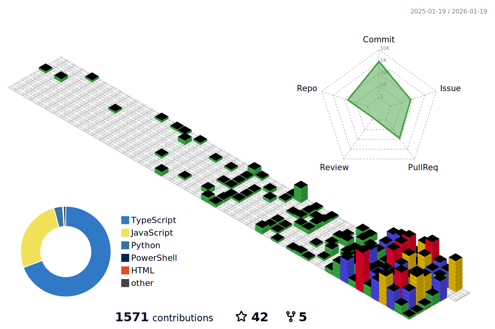

- 👋 Hi, I’m @magisk317
- 👀 I’m interested in backend engineering, developer tools, and open‑source automation.
- 🌱 I’m currently learning Tangping.
- 💞️ I’m looking to collaborate on TypeScript/Node.js projects and tooling.
- 📫 How to reach me: GitHub Issues
<!---
magisk317/magisk317 is a ✨ special ✨ repository because its `README.md` (this file) appears on your GitHub profile.
You can click the Preview link to take a look at your changes.
--->

